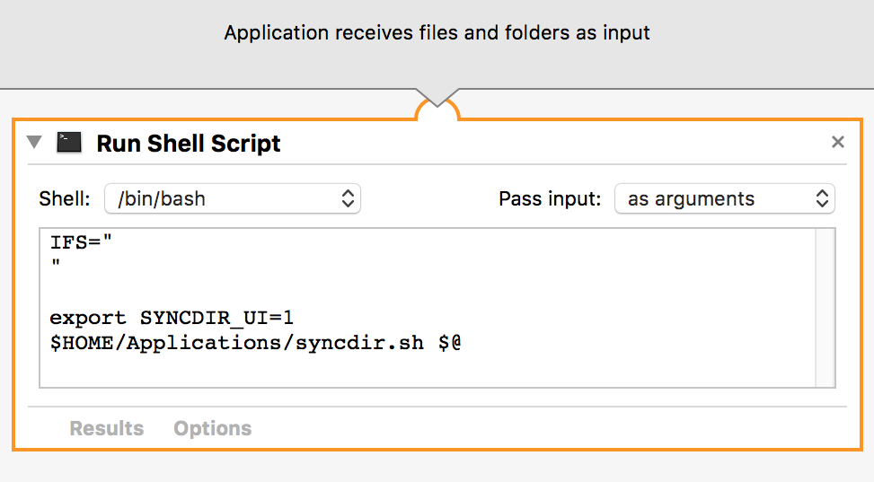

Usage of Sync Dir Manager
==============================================================================

    usage 1: syncdir.sh <directory> [<dirN>] ...

Create config files with extension *.syncdir in $LOCAL_DIR for each
directory given in the arguments. The files can be moved into other
locations before syncing is executed (see usage 2).

    usage 2: syncdir.sh <syncdir-file> [<syncdir-fileN>] ...

Execute the synchronization between the 2 directories A and B, where:  
  A: was writen in the syncdir-file (by the usage 1, which created this file)
  B: the same directory but below the directory where the syncdir file is

Author
======
SyncDirManager Copyright (C) 2016 Michael Augustin
Feel free to contact me via mail `maugustin (at) gmx (dot) net`

This program comes with ABSOLUTELY NO WARRANTY.
This is free software, and you are welcome to redistribute it
under certain conditions.

INSTALL instructions
====================

1. Install Unison, that can be downloaded from https://www.cis.upenn.edu/~bcpierce/unison/
 * on Mac OSX: run from menu "Unison" option "Install commandline tool"
 * others: make sure `unison` executable cat be found in PATH

Selfmade UI on Mac OSX
-------------

If you like to use a app to start this tool, follow these steps:

 * open "Automator" app
 * create a "new application"
 * add the workflow step "Run shell script" from category "Utilities"
 * set option for `Pass input` (top right ) to `as arguments`
 * paste in the following text:

		IFS="
		"
		export SYNCDIR_UI=1
		$HOME/Applications/syncdir.sh $@

 * adapt the path to the `syncdir.sh` script according to your location

 * save the Automator-App in e.g. `$HOME/Applications/` as e.g. SyncDir.app
 * take a directory and let it drop on the SyncDir.app application
 * in directory `$HOME/SyncDirectoryManager` a new `*.syncdir` file should exists
 * open "Information" about this file
 * select as "Open with" the SyncDir.app and click on "Change All..."

 * drag the app to you dock if you like
 * if you drop a directory or file on the app a new `*.syncdir` file is created
 * if you drop a `*.syncdir` file or double click a `*.syncdir` file in the Finder the sync runs

General Remarks
===============
 1. The *.syncdir file can be put everywhere on your local disks to specify the local sync dir
 1. Set the env variable `export SYNCDIR_UI=1` to use the graphical interface to Unison to preview sync steps. Don't forget to push "Go" to start the sync in Unison.
 1. It's possible to add some options in the `*.syncdir` file, e.g.:

	| Keyword | Description |
	|--------|--------|
	|BATCH | to run without interaction (default: false with UI) |
	|INPLACE |to not create a subdir, but in the same dir as `*.syncdir` is|
	|UNISON_CFG `<unison option>` | to add any special option for unison |
	|RUN `<syncdir file>` | to run additional syncdir files, from this one or run a check before start syncing |
	|FAT | sync with Windows FAT drive |
	|IGNORE `<regex>` | Ignore some file or directories matching this regex |
	|INCLUDE '<dir>' | sync only subdir matching this name (can be listed multiple times) |
	|SOURCE_IS_REMOTE | default sync from REMOTE to local dir (when using non-ui) |
 
